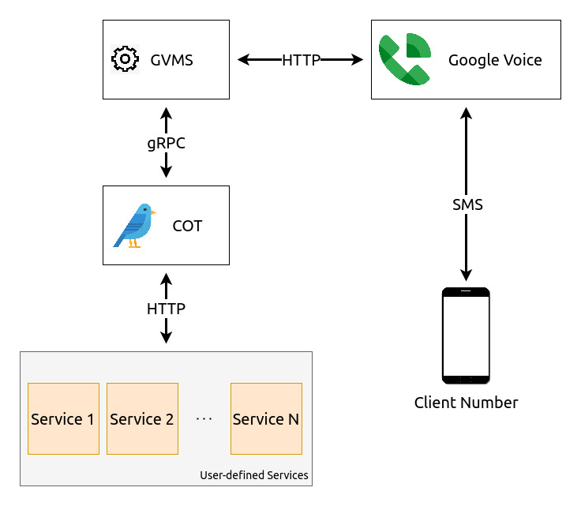
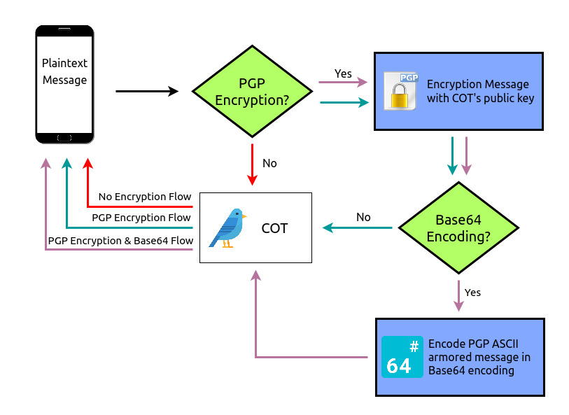

# **COT**
Commands over text(COT) is bridge for sending user-defined commands over the SMS/MMS
protocol. This offers and alternative method for sending commands without the need
to do any port forwarding.

COT's generic architecture allows it to avoid any coupling with the would be
commands as each command is executed via an external client service. Thus, COT
only needs to know the bindings and will propagate the command request to the
actual client service which will contain the appropriate logic for dealing with
the request.

COT's main benefit arises with the ability to interact with internal services without
the need to do any port forwarding or exposure to the public internet. Thus, with COT
running on the same network as the internal services, commands can be created along with
client service wrappers which will accept requests from cot and then further pass them
on to the internal services.

## **Terminology**
- **Client Number=** phone number that sends the command request.
- **GVoice Number=** Gvoice phone number that services as receiver for commands that
  come from client numbers.
- **GVMS=** microservice for interacting with GVoice's APIs.
- **Client Service=** user-defined service that is implemented externally of COT and is
  responsible for taking in a command request, executing it, and returning the response.

## **Architecture**


COT, being generic, enables one to create any command they want as long as one defines
it within `cot_sm.yaml`. Within the config file, one would specify:
1. Name of the command.
2. Client service that will execute the command.
3. List of client numbers authorized to use the command.

### **Flow**
The end-to-end flow starting from the client number is as follows:
1. Client sends command in "[cmd] [arg 1] [arg 2] ... [arg N]" format to the configured
   GVoice number.
3. COT would have initialized a worker that checks the (GVoice Number, Client Number)
   link periodically via GVMS. By listening to only the subnet of defined client numbers,
   COT, by nature, will ignore all numbers that have not been whitelisted by any of the
   services within `cot_sm.yaml`.
4. COT parsers the command and checks if the client number is authorized to run this command.
   Non-authorized commands will be rejected.
5. The arguments of the command will be sent as an array of args to the client service's endpoint
   that was defined for that specified command within `cot_sm.yaml`.
6. The output of the command would then be transmitted back to the client number.

#### **Example**
Assuming these commands are the only commands defined within `cot_sm.yaml`
```yaml
services:
  - name: lights
    base_uri: "http://localhost:9877"
    client_numbers:
    - 1415111111
  - name: email
    base_uri: "http://localhost:9876"
    client_numbers:
    - 1415111111
    - 1415111112
```

If `1415111111` sends a command such as "lights off", COT will verify that this number is
authorized and will send `{args: "off"}` to `/cmd` endpoint of `http://localhost:9877`.
However, if `1415111112` tries to do the same, the request will fail as it is not authorized.
Likewise, another number `1415111113` will fail regardless of the `lights` or `email` command as
they are not authorized for either. All 3 numbers will be rejected for any other commands as
no other commands exist.

## **Defining Commands & Associated Client Services**
All commands are defined as list items under the `services:` section. Each command must follow
this schematic
```yaml
- name: "name of command"
  base_uri: "base uri of server executing the command"
  client_numbers:
  - "client number 1"
  - "...."
  - "client number n"
```

As of now, a client service must expose the `/cmd` endpoint for the POST method. However, it
is possible to specify an alternative endpoint by setting the `endpoint` key for a service within
the `cot_sm.yaml` configuration file. Arguments will be passed in as JSON as `{args: [...]}` via
an arg array in the exact same order they were sent by the client number. The endpoint must return
a response with a message defined in the `message` key. Optionally, an error can be returned via
the `error` key
```json
{
    "message": "",
    "error": "optional"
}
```

## **Encryption**

Given that the SMS/MMS protocol is the foundation for COT, all messages will be visible
by default. This includes but is not limited to ATT, Verizon, Google (due to GVoice), among
other parties. Thus, this pushes the need for encryption.

As seen in the diagram, COT features 3 main flows, though further tweaking is possible with some
limitations.

### **Flows**

#### **No Encryption Flow**
This is the least secure of all flows and should be used in the case where the 2 other flows are
not viable.

#### **PGP Encryption Flow**
This flow requires the client number to sign the command request with COT's public key prior to
sending the message. The ASCII armored message will then be sent to COT. COT will send the response
encrypted with the client number's public key.

#### **PGP Encryption Flow & Base64**
This flow requires the client number to sign the command request with COT's public key prior to
sending the message. Afterwards, the ASCII armored message would then need to be base64 encoded.
In the response message, COT will do the same and base64 encode the ASCII armoured message. The 
reason behind base64 encoding is due to some MMS/SMS clients on Android doing compression. Even
though the compression might seem harmless, PGP requires certain schema and this will render the
message useless. Thus, using base64 will preserve all the formatting in order to prevent corruption.

### **Note on PGP Signatures**
For the *PGP Encryption* and *PGP Encryption & Base64* flows, the option to set
`COT_SIG_VERIFICATION` is possible. This will validate that the input command is signed by
the client number and will also sign the response with COT's private key. However, some SMS/MMS
phone clients contain message size caps (even though MMS theoretically supports 5Mb messages), and
thus this option should might not work everywhere. Thus, unless tested that it works for your needs,
`COT_SIG_VERIFICATION` should remain as `false`. If set to false, avoid ensure that signing is off
from the PGP client app used on the client number phone, in order to avoid large message sizes.

### **Note on PGP and Base64 Encoding From Client Side**
Since there is no user client for COT as it is intended to use the default SMS/MMS client, one
would have to download a PGP encoding/decoding as well as a base64 encoding/decoding app from the
App Store/Play Store and do the steps themselves each time.

#### **PGP Encryption Flow**
1. Encrypt command with PGP app.
2. Send output to COT via SMS/MMS client.
3. After response arrives from COT, paste it into PGP app's decoder and see command output.

#### **PGP Encryption & Base64 Flow**
1. Encrypt command with PGP app.
2. Paste encrypted message into encoder of Base64 app.
3. Send output to COT via SMS/MMS client.
4. After response arrives from COT, paste it into decoder of Base64 app.
5. Copy output and paste into PGP app's decoder and see command output.

## **Configuration**

### **Service & Command Configuration**
Configuration is done via the `cot_sm.yaml` file which needs to be copied/renamed from 
`cot_sm_template.yaml`. By default, the file needs to be located in the same directory as
the executable or `main.go`, unless an alternate path is specified via the `COT_CONF_DIR`
environment variable. Aside from defining services which were explained
[here](#defining-user-commands), the gvoice number that all client numbers will be sending
commands to needs to be defined via `gvoice_number`. Similarly, GVMS config needs to be defined
which sets the binding of what hostname and port GVMS is running on.

### **Encryption Configuration**
The follow environment variables can be defined in the case were encryption is enabled. If
encryption is not enabled, then none of these environment variables need to be set.
- **COT_TEXT_ENCRYPTION=** whether encryption is enabled (true, false)
- **COT_PUBLIC_KEY_FILE=** path to COT's public PGP key
- **COT_PRIVATE_KEY_FILE=** path to COT's private PGP key
- **COT_PASSPHRASE=** passphrase for COT's private PGP key
- **COT_CN_PUBLIC_KEY_DIR=** directory that will store all of the client number public PGP keys
- **COT_SIG_VERIFICATION=** whether signature verification is enabled for PGP
- **COT_BASE64_ENCODING=** whether messages will be base64 encoded

## **Installation**
- Setup GVMS as explained [here](https://github.com/kingcobra2468/GVMS).
- Clone COT and setup [configuration](#configuration).
- Install dependencies with `go get`.
- Launch COT with `go run main.go`.